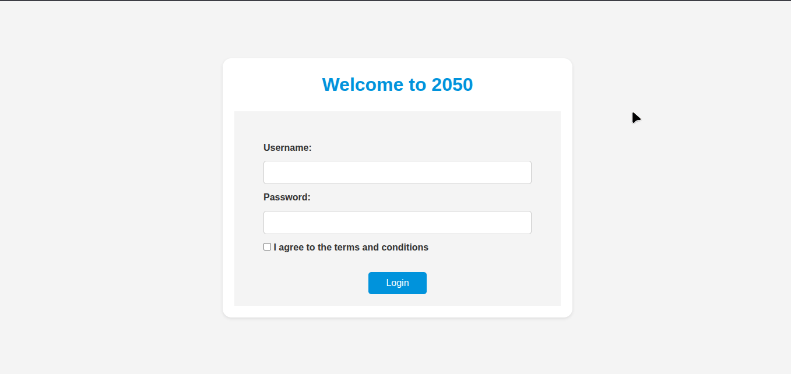

# 2050 Login Page 🚀

A playful and futuristic login page where the **login button literally runs away** if you try to click it without filling in the input fields correctly.  

This project is built with **HTML, CSS, and JavaScript**, and is part of my journey at **MRBENWORKSHOP** to sharpen my web development skills while having fun with creative UI/UX ideas.  

---

## ✨ Features
- 🎮 **Interactive Button** → dodges your cursor until all fields are filled  
- 🖌️ **Futuristic Design** → clean, minimal, and responsive  
- 📱 **Responsive Layout** → works on desktop and mobile  

---

## 🎯 Purpose
The goal of this project is to explore **creative front-end interactions** and build a fun yet educational project that strengthens my understanding of **DOM manipulation, CSS styling, and user experience design**.  

---

## 🖼️ Preview
  
*(GIF or screenshot demo will be added here)*  

---

## 🛠️ Tech Stack
- **HTML5** → structure  
- **CSS3** → styling and layout  
- **JavaScript (ES6)** → interaction and logic  

---

## 📂 How to Use
1. Clone the repository:
   ```bash
   git clone https://github.com/mrbenworkshop/2050-login-page.git
